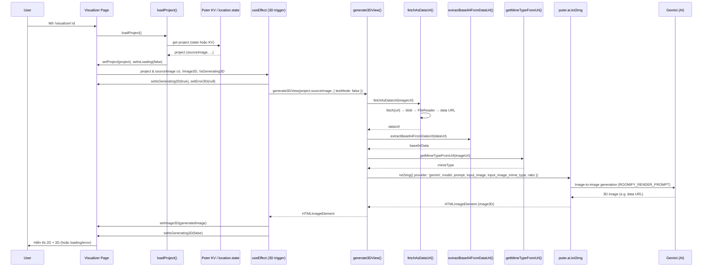
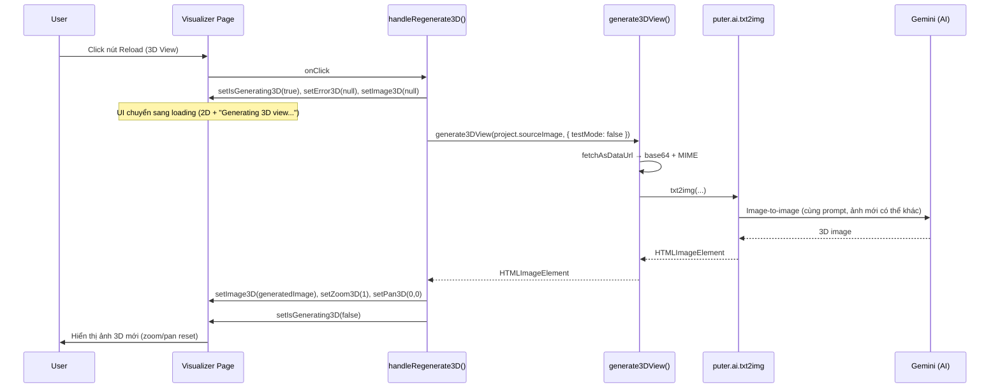

# 3D Design Generation Flow

Tài liệu này mô tả luồng generate 3D view từ ảnh floor plan 2D và cách ảnh 3D được quản lý trong ứng dụng Roomify.

## Overview

Hệ thống chuyển ảnh floor plan 2D thành visualization 3D (top-down, photorealistic) bằng Puter AI (Gemini image model). Có hai cách kích hoạt:

1. **Tự động lần đầu**: Khi mở Visualizer với project đã có `sourceImage`, nếu chưa có ảnh 3D thì sẽ tự gọi generate.
2. **Thủ công (Reload)**: User bấm nút Reload trên panel 3D View để generate lại ảnh 3D mới từ cùng source 2D.

Ảnh 3D được giữ **trong state của Visualizer** (trong phiên hiện tại). Không lưu ảnh 3D vào KV store hay hosting; mỗi lần mở lại project sẽ generate lại (trừ khi có cache phía Puter/trình duyệt).

## Các thành phần liên quan

| Thành phần | Vai trò |
|------------|--------|
| **Visualizer** (`app/routes/visualizer.$id.tsx`) | Load project, trigger generate (useEffect hoặc nút Reload), quản lý state `image3D`, `isGenerating3D`, `error3D`, hiển thị 2D/3D và loading/error. |
| **generate3DView** (`lib/ai.action.ts`) | Nhận URL ảnh 2D, chuẩn hóa sang base64 + MIME, gọi Puter AI txt2img, trả về `HTMLImageElement` (3D). |
| **Puter AI** (`puter.ai.txt2img`) | Image-to-image generation với prompt 3D (Gemini model). |
| **ROOMIFY_RENDER_PROMPT** (`lib/constants.ts`) | Prompt mô tả yêu cầu: top-down 3D, bỏ text, geometry khớp bản vẽ, đồ nội thất theo icon, v.v. |

## Điều kiện generate (tự động)

Generate 3D chỉ chạy tự động khi **tất cả** điều kiện sau thỏa:

- `project` đã load và có `project.sourceImage`
- `!isLoading` (đã load xong project)
- `!image3D` (chưa có ảnh 3D)
- `!isGenerating3D` (không đang generate)

Khi user bấm **Reload**, logic không phụ thuộc `image3D`: sẽ clear ảnh cũ, set `isGenerating3D = true`, gọi `generate3DView` với `project.sourceImage`.

## Sequence Diagram – Tự động generate lần đầu

## Sequence Diagram – User bấm Reload (regenerate 3D)

## Luồng chi tiết trong `generate3DView` (lib/ai.action.ts)

1. **fetchAsDataUrl(imageUrl)**  
   - Nếu URL đã là data URL → return ngay.  
   - Ngược lại: `fetch` → `response.blob()` → `FileReader.readAsDataURL()` → trả về data URL.

2. **extractBase64FromDataUrl(dataUrl)**  
   - Lấy chuỗi base64 (bỏ prefix `data:image/...;base64,`).

3. **getMimeTypeFromUrl(url)**  
   - Từ data URL hoặc đuôi file → `image/png`, `image/jpeg`, `image/webp`.

4. **Prompt**  
   - Dùng `options.prompt` hoặc `ROOMIFY_RENDER_PROMPT` (3D top-down, bỏ text, geometry khớp, đồ nội thất theo icon, lighting/material).

5. **puter.ai.txt2img(aiOptions)**  
   - `provider: 'gemini'`, `model` (mặc định `gemini-2.5-flash-image-preview`), `prompt`, `input_image` (base64), `input_image_mime_type`, `ratio: { w: 1024, h: 1024 }`.  
   - Có thể truyền `test_mode: true` (qua `options.testMode`) để test không trừ credits.

6. **Kết quả**  
   - Trả về `HTMLImageElement` có `src` là data URL của ảnh 3D.  
   - Lỗi (network, API, model) được bọc và throw với message rõ ràng.

## Lưu ảnh 3D (state, không persist)

- Ảnh 3D được lưu **trong memory** dưới dạng `image3D: HTMLImageElement | null` trong state của Visualizer.
- **Không** ghi vào Puter KV store và **không** upload lên hosting; chỉ dùng để hiển thị và download trong phiên hiện tại.
- Khi user tải xuống (Download 2D+3D hoặc Export), ảnh 3D lấy từ `image3D.src` (data URL) để tạo link download.

Nếu sau này cần “lưu” 3D lâu dài, cần thêm bước: upload blob từ data URL lên hosting (tương tự `uploadImageToHosting`) và lưu URL vào project (ví dụ `project.rendered3DUrl`) trong KV.

## Error handling

- **Trong generate3DView**: Mọi lỗi (fetch, AI, network) được throw với message dạng `Failed to generate 3D view: ...`.
- **Trong Visualizer**:  
  - useEffect: `catch` → `setError3D(message)`, `setIsGenerating3D(false)`.  
  - handleRegenerate3D: tương tự.  
- UI: Khi `error3D` có giá trị, hiển thị panel 2D + khối “3D Generation Failed” và message lỗi.

## Tóm tắt

| Sự kiện | Hành động |
|--------|-----------|
| Mở Visualizer, project có sourceImage, chưa có 3D | useEffect gọi `generate3DView` một lần. |
| User bấm Reload (3D) | `handleRegenerate3D` clear ảnh cũ, gọi `generate3DView`, cập nhật state và zoom/pan. |
| Ảnh 3D | Chỉ nằm trong state (HTMLImageElement); không persist KV/hosting. |
| Download/Export | Dùng `image3D.src` (data URL) để tạo file tải xuống. |
