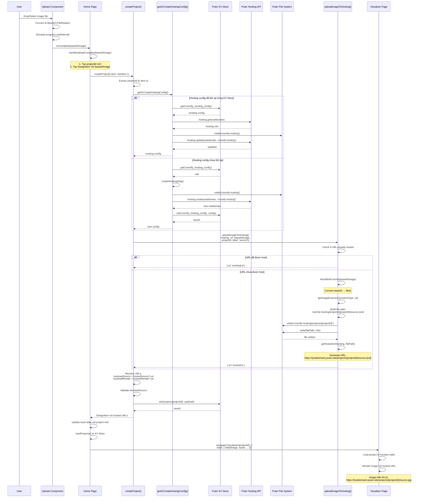

# Image Upload & Hosting Flow

Tài liệu này mô tả chi tiết luồng upload và host images trong ứng dụng Roomify.

## Overview

Khi user upload một floor plan image, hệ thống sẽ:
1. Nhận base64 image từ Upload component
2. Tạo project mới với unique ID
3. Get hoặc tạo hosting subdomain
4. Upload image lên Puter hosting
5. Lưu project metadata vào KV store
6. Navigate đến visualizer với hosted URL

## Sequence Diagram



## Detailed Flow Steps

### 1. Image Upload (Upload Component)

**Input**: File object từ user (drag-drop hoặc file input)

**Process**:
- Convert file thành Base64 string bằng `FileReader.readAsDataURL()`
- Simulate progress với `setInterval` (PROGRESS_INTERVAL_MS, PROGRESS_STEP)
- Khi progress đạt 100%, đợi REDIRECT_DELAY_MS rồi gọi `onComplete(base64Image)`

**Output**: Base64 data URL string (`data:image/jpeg;base64,...`)

---

### 2. Project Creation (Home Page)

**Function**: `handleUploadComplete(base64Image: string)`

**Steps**:
1. Tạo `projectId` mới: `Date.now().toString()`
2. Tạo tên project: `Residence {projectId}`
3. Tạo `DesignItem` object với:
   - `id`: projectId
   - `name`: tên project
   - `sourceImage`: base64Image
   - `renderedImage`: null
   - `timestamp`: Date.now()
   - `ownerId`: userId từ auth context
4. Gọi `createProject({ item: newItem })`

---

### 3. Hosting Configuration

**Function**: `getOrCreateHostingConfig()`

**Purpose**: Đảm bảo mỗi user có một hosting subdomain để host images

**Flow**:

#### Case 1: Config đã tồn tại
1. Lấy config từ KV store với key `'roomify_hosting_config'`
2. Verify subdomain tồn tại với `puter.hosting.get(subdomain)`
3. Đảm bảo directory `'roomify-hosting'` tồn tại
4. Update hosting để point đến directory (nếu cần)
5. Return existing config

#### Case 2: Config chưa tồn tại
1. Tạo slug unique: `roomify-{timestamp}-{random}`
2. Tạo directory `'roomify-hosting'` trên Puter FS
3. Tạo hosting subdomain với `puter.hosting.create(subdomain, 'roomify-hosting')`
4. Lưu config vào KV store
5. Return new config

**Output**: `HostingConfig { subdomain: string }`

---

### 4. Image Upload to Hosting

**Function**: `uploadImageToHosting({ hosting, url, projectId, label })`

**Purpose**: Upload image lên hosting subdomain và trả về hosted URL

**Steps**:

1. **Validate Input**
   - Check hosting config và URL có tồn tại không

2. **Check if Already Hosted**
   - Nếu URL đã chứa `.puter.site` → return ngay (không upload lại)

3. **Resolve Image to Blob**
   - Nếu `label === 'rendered'`: Convert sang PNG blob
   - Nếu `label === 'source'`: Fetch blob từ URL (base64 hoặc external URL)

4. **Determine File Extension**
   - Từ contentType hoặc URL
   - Default: `'png'`

5. **Build File Path**
   - Directory: `roomify-hosting/projects/{projectId}/`
   - File: `{label}.{ext}` (ví dụ: `source.jpg`, `rendered.png`)

6. **Create Directory Structure**
   - `puter.fs.mkdir(dir, { createMissingParents: true })`

7. **Upload File**
   - `puter.fs.write(filePath, File)`

8. **Generate Hosted URL**
   - `getHostedUrl(hosting, filePath)`
   - Format: `https://{subdomain}.puter.site/projects/{projectId}/{label}.{ext}`
   - **Note**: Loại bỏ `roomify-hosting/` prefix vì subdomain đã point đến directory đó

**Output**: `HostedAsset { url: string }` hoặc `null` nếu fail

---

### 5. Project Save

**Function**: `createProject({ item })`

**Steps**:
1. Get hosting config
2. Upload source image → get `hostedSource`
3. Upload rendered image (nếu có) → get `hostedRender`
4. Resolve URLs:
   - `resolvedSource = hostedSource?.url || (isHostedUrl(item.sourceImage) ? item.sourceImage : '')`
   - `resolvedRender = hostedRender?.url || (isHostedUrl(item.renderedImage) ? item.renderedImage : undefined)`
5. Validate: Nếu không có `resolvedSource` → return `null`
6. Create payload với resolved URLs
7. Save vào KV store: `puter.kv.set('project:{projectId}', payload)`

**Output**: `DesignItem` với hosted URLs hoặc `null` nếu fail

---

### 6. Navigation to Visualizer

**Function**: `handleUploadComplete()` (continued)

**Steps**:
1. Verify image URL có accessible không (optional HEAD request)
2. Update local state với project mới
3. Reload projects từ KV store
4. Navigate với state:
   ```typescript
   navigate(`/visualizer/${projectId}`, {
     state: {
       initialImage: saved.sourceImage,      // Hosted URL
       initialRendered: saved.renderedImage || null,
       name: saved.name || null,
       ownerId: saved.ownerId || null,
     }
   })
   ```

---

### 7. Visualizer Display

**Component**: `Visualizer`

**Steps**:
1. Lấy `projectId` từ URL params
2. Lấy project data từ `location.state` (nếu navigate từ home)
3. Nếu không có state → load từ KV store với key `'project:{projectId}'`
4. Render image với `src={project.sourceImage}` (hosted URL)
5. Image được load từ: `https://{subdomain}.puter.site/projects/{projectId}/source.jpg`

---

## Key Components

### File Structure

```
roomify-hosting/                    # Root hosting directory
└── projects/                       # Projects directory
    └── {projectId}/                # Project-specific directory
        ├── source.jpg              # Source image
        └── rendered.png           # Rendered image (if exists)
```

### URL Structure

```
https://{subdomain}.puter.site/projects/{projectId}/source.jpg
https://{subdomain}.puter.site/projects/{projectId}/rendered.png
```

### KV Store Keys

- `roomify_hosting_config`: Hosting configuration
  ```typescript
  { subdomain: 'roomify-abc123-def456' }
  ```

- `project:{projectId}`: Project data
  ```typescript
  {
    id: string,
    name: string,
    sourceImage: string,      // Hosted URL
    renderedImage: string | null,
    timestamp: number,
    ownerId: string | null,
    ...
  }
  ```

---

## Error Handling

### Common Errors

1. **Hosting Config Not Found**
   - **Action**: Tạo hosting config mới
   - **Fallback**: Return `null` → project không được save

2. **Image Upload Failed**
   - **Action**: Log error, return `null`
   - **Fallback**: Project không được save

3. **KV Store Save Failed**
   - **Action**: Log error, return `null`
   - **Fallback**: Project không được persist

4. **Image URL Not Accessible**
   - **Action**: Show error indicator (red border, opacity)
   - **Fallback**: Display placeholder

---

## Performance Considerations

1. **Hosting Config Reuse**: Config được cache trong KV store để tránh tạo subdomain mới mỗi lần upload

2. **Already Hosted Check**: Nếu URL đã được host, skip upload process

3. **Directory Structure**: Files được organize theo project để dễ quản lý và cleanup

4. **Lazy Loading**: Images chỉ được load khi visualizer component mount

---

## Future Improvements

1. **Image Optimization**: Compress images trước khi upload
2. **CDN Integration**: Sử dụng CDN để serve images nhanh hơn
3. **Batch Upload**: Upload nhiều images cùng lúc
4. **Image Caching**: Cache hosted URLs để tránh re-upload
5. **Cleanup**: Xóa old projects và images không còn sử dụng
